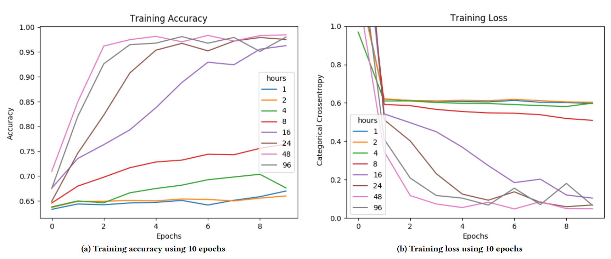

# Notes

## Article details

**Title:** One-Dimensional Convolutional Neural Networks on Motor Activity Measurements in Detection of Depression.

**Authors:** Frogner, J.I., Noori, F.M., Halvorsen, P., Hicks, S.A., Garcia-Ceja, E., Torresen, J. and Riegler, M.A.

**Citation:** (Frogner et al., 2019)

**Bibliography:** Frogner, J.I., Noori, F.M., Halvorsen, P., Hicks, S.A., Garcia-Ceja, E., Torresen, J. and Riegler, M.A. (2019) One-Dimensional Convolutional Neural Networks on Motor Activity Measurements in Detection of Depression. In: Proceedings of the 4th International Workshop on Multimedia for Personal Health & Health Care [online]MM ’19: The 27th ACM International Conference on Multimedia. Nice France, ACM, pp. 9–15. Available from: https://dl.acm.org/doi/10.1145/3347444.3356238 [Accessed 18 February 2024].

## Notes

### Abstract

"We use convolutional neural networks to classify the depressed and nondepressed patients. Moreover, different levels of depression were classified. Finally, we trained a model that predicts MontgomeryÅsberg Depression Rating Scale scores. We achieved an average F1-score of 0.70 for detecting the control and condition groups. The mean squared error for score prediction was approximately 4.0."

### Introduction

"One-Dimensional convolutional neural networks (1D-CNNs) are used on motor activity measurements to detect the depression. Afterwards, three levels of depression (i.e., no depression, mild, and severe depression) were detected based on the Montgomery-Åsberg Depression Rating Scale (MADRS) [13]. Our third model predicts the MADRS score of participants. The motivation behind using 1D-CNN is that feature extraction would be done automatically."

"The main contributions of this paper is to build 1D-CNN in order to: (i) Detect whether a participant is depressed or not; (ii) Detect whether a participant has no depression, mild depression, or severe depression; (iii) Predict participant’s MADRS score which further can be used to distinguish between depressed and non-depressed patients."

* classify if control or condition
* classify how depressed (severity)
* predict MADRS score 

Segment length - tried 1, 2, 4, 8, 16, 24, 48, 96 hours

"When using Synthetic Minority Over-sampling Technique (SMOTE) as a technique for generating more data, they increased their random forest F1-score to 0.73. **An extension of this work could be to attempt to use the same sampling strategies as Garcia-Ceja et al. did on the data passed into our CNN.**"