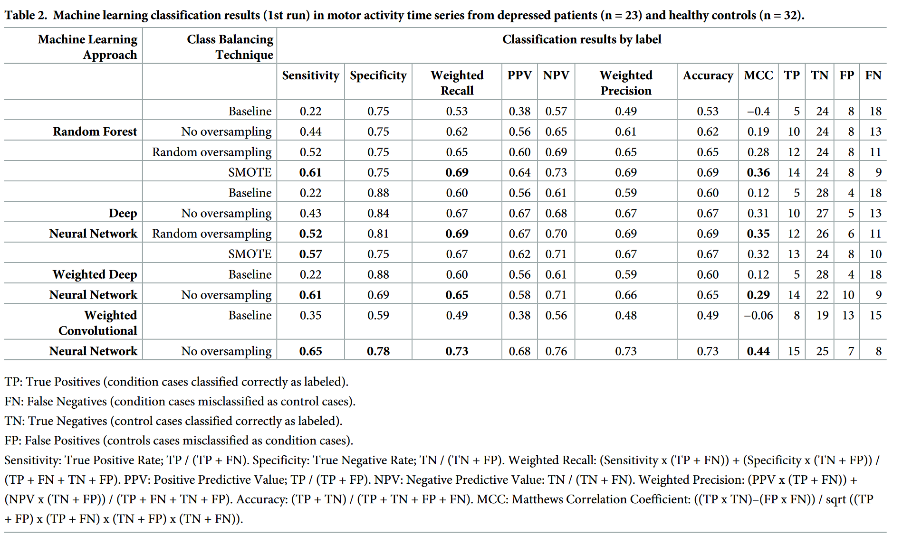

# Notes

## Article details

**Title:** Applying machine learning in motor activity time series of depressed bipolar and unipolar patients compared to healthy controls

**Authors:** Jakobsen, P., Garcia-Ceja, E., Riegler, M., Stabell, L.A., Nordgreen, T., Torresen, J., Fasmer, O.B. and Oedegaard, K.J. 

**Citation:** (Jakobsen et al., 2020)

**Bibliography:** Jakobsen, P., Garcia-Ceja, E., Riegler, M., Stabell, L.A., Nordgreen, T., Torresen, J., Fasmer, O.B. and Oedegaard, K.J. (2020) Applying machine learning in motor activity time series of depressed bipolar and unipolar patients compared to healthy controls. PLOS ONE [online]. 15 (8), p. e0231995. Available from: https://journals.plos.org/plosone/article?id=10.1371/journal.pone.0231995 [Accessed 18 February 2024].

## Notes

### Abstract

"Motor activity isan objective observation ofthe inner physiological state expressed inbehavior patterns. Alterations ofmotor activity are essential features ofbipolar and unipolar depression. The aim was toinvestigate ifobjective measures ofmotor activity can aid existing diagnostic practice, by applying machine-learning techniques toanalyze activity patterns indepressed patients and healthy controls."

"`Random Forrest`, `Deep Neural Network` and `Convolutional Neural Network` algorithms were used to analyze 14 days ofactigraph recorded motor activity from 23 depressed patients and 32 healthy controls. Statistical features analyzed in the dataset were `mean activity`, `standard deviation of mean activity` and `proportion of zero activity`."

"ADeep Neural Network combined with SMOTE class balancing technique performed acut above the rest with atrue positive rate of0.82 (sensitivity) and atrue negative rate of0.84 (specificity). Accuracy was 0.84 and the Matthews Correlation Coefficient 0.65. Misclassifications appear related to data overlapping among the classes, so an appropriate future approach will be tocompare mood states intra-individualistically."

### Intro

"Techniques like Random Forest [20] and neural networks [21, 22] have revealed promising abilities to handle time series of activation data"

**blackboxes**

"A neural network might be understood as amathematical model, where millions of parameters automatically fine-tunes to optimize the models’ performance [23, 24]. Consequently, insight into the lines of argument isdifficult. However, there are methods that allow the interpretation of neural network internals to some extent [25]. Within medical science, there is skepticism of such ablack-box method generating calculations without an explanation"

**leave one out to counter overfitting**

"To avoid overfitting, we adopted aLeave-One-User-Out validation strategy, i.e., for each user i,use all the data from all other users notequal toi to train the classifier and test them using the data from user i."

### results

### more results

see article for more results etc.

### conclusion

"In conclusion, this study has illustrated the promising abilities of various machine learning algorithms to discriminate between depressed patients and healthy controls in motor activity time series. Furthermore, that the machine learning ́s ways of finding hidden patterns in the data correlates with existing knowledge from previous studies employing linear and nonlinear statistical methods in motor activity. In our experiment, Deep Neural Network performed unsurpassed in discriminating between conditions and controls. Nonetheless, considering that the analyzed sample was both small and heterogeneous, we should be careful when concluding on which algorithm was the most accurate. Finally, we have enlightened the heterogeneity within depressed patients, as itisrecognizable in motor activity measurements."