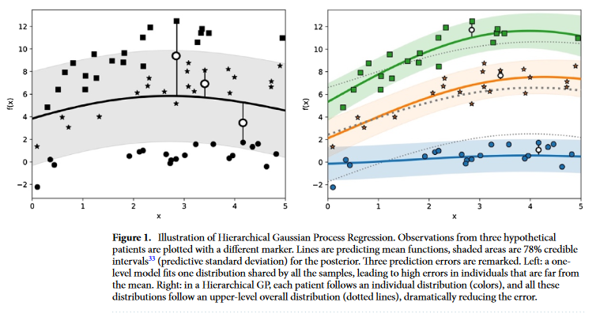
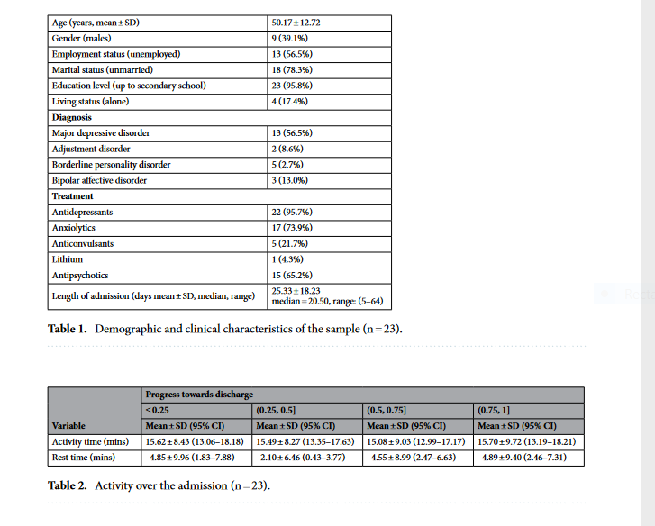
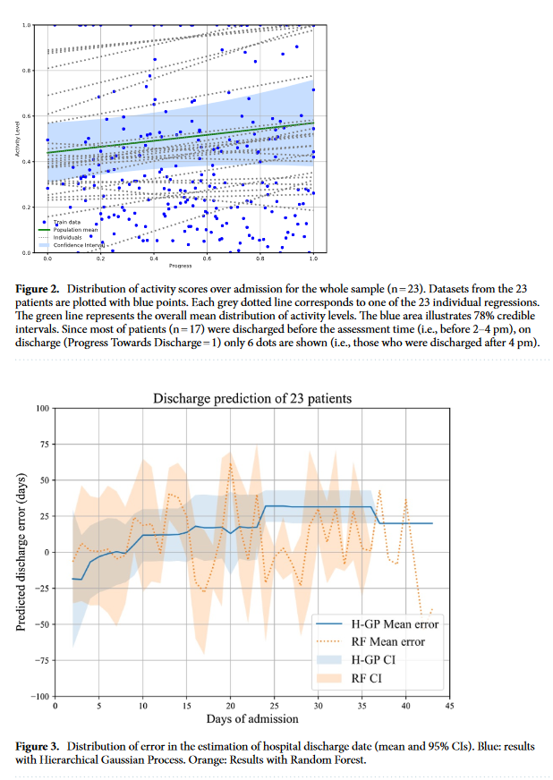
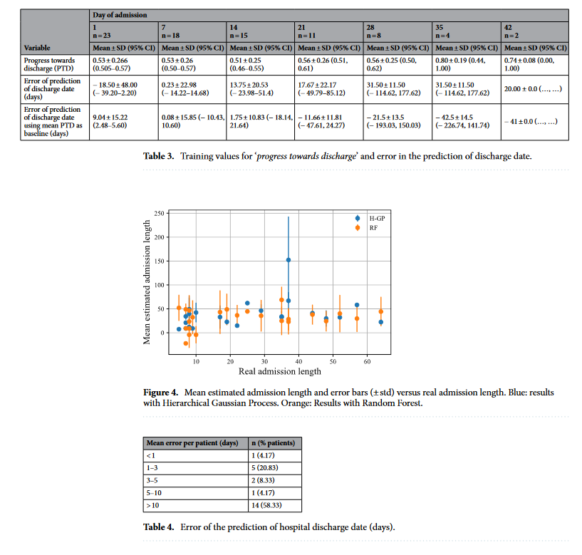

# Notes
## Article details
**Title:** Actigraphic recording of motor activity in depressed inpatients: a novel computational approach to prediction of clinical course and hospital discharge.

**Authors:** Ignacio Peis, Javier‑David López‑Moríñigo, M. Mercedes Pérez‑Rodríguez, Maria‑Luisa Barrigón, Marta Ruiz‑Gómez, Antonio Artés‑Rodríguez & Enrique Baca‑García.

**Citation:** (Peis et al., 2020)

**Bibliography:** Peis, I., López-Moríñigo, J.-D., Pérez-Rodríguez, M.M., Barrigón, M.-L., Ruiz-Gómez, M., Artés-Rodríguez, A. and Baca-García, E. (2020) Actigraphic recording of motor activity in depressed inpatients: a novel computational approach to prediction of clinical course and hospital discharge. Scientific Reports [online]. 10 (1), p. 17286.

## Notes
### Summary

### Methods
**Participants:** Depressed adult inpatients admitted to the psychiatric ward of Hospital Rey Juan Carlos (Móstoles, Madrid, Spain) between January 1, 2014, and December 31, 2016, were recruited. The inclusion criteria covered individuals diagnosed with depressive disorders, including major depressive disorder (MDD), adjustment disorder, and bipolar depression (based on DSM-IV-TR codes). Diagnoses were established by senior consultant psychiatrists, with consent obtained from participants or their legal guardians. Ethical approval was obtained from the Institutional Review Board of the Research Institute of the Foundation Jiménez Díaz.

**Actigraphy Data Recording:** Miniature wireless inertial sensors (Shimmer 3 sensor, Shimmer) were worn by participants to record daily physical activity. These sensors included triaxial accelerometers and gyroscopes to measure inertial force and angular velocity, respectively. Actigraphy data were processed using a Hidden Markov Model (HMM) for Human Activity Recognition (HAR). The sensors were placed on patients' wrists daily by nursing staff, and data were collected during a 2-hour period (2-4 pm) representing unstructured ward time. Activity data included classifications of running, walking, standing up, sitting, or lying down.

**Variables**

**- Activity-related variables**
- Activity Time: The duration (in minutes) of the highest level of activity within the 2-4 pm window.
- Rest Time: The duration (in minutes) of rest or inactivity during the same window.

**- Time-related variables**
- Days of admission (DoA): The number of days a patient had been admitted to the ward.
- Progress Towards Discharge (PTD): A normalised variable indicating the proportion of the total length of stay completed by a patient at any given time.
- Error of Prediction of Hospital Discharge: The difference (in days) between the real discharge date and the estimated discharge date based on activity data.

**Statistical and Mathematical Analyses**

**- Hierarchical Generalised Linear Model (HGLM):** Used to examine the increase in activity levels over the admission period. The model correlated 'Activity Time' with 'PTD'.

**- Hierarchical Gaussian Process (HGP) Model:** Employed to predict hospital discharge dates based on early activity data. 'Activity Time', 'Rest Time', and 'DoA' were input variables predicting 'PTD'. The HGP model utilised hierarchical levels to model data distribution probability, allowing individualised regressions fitted to each patient. The model incorporated a recursive algorithm for predicting clinical course and estimating discharge dates.
- Leave-one-out validation: A robust validation method was employed, considering similarities between patients' activity patterns to predict outcomes.
- Comparison with other models: Preliminary analyses favoured the HGP approach due to its ability to handle between-patient variations and accurately measure uncertainty.

### Results

**Demographic and Clinical Characteristics**

- A total of 23 subjects diagnosed with depressive disorders participated in the study.
- The sample comprised Caucasian individuals admitted to the acute psychiatric ward at Hospital Rey Juan Carlos.
- Demographic and clinical characteristics were analysed using SPSS.

**Actigraphy Data**

- Activity-related variables, namely 'Activity Time' and 'Rest Time', were summarised at four clinically meaningful times over the admission based on Progress Towards Discharge (PTD) values.
- Overall, motor activity levels increased over the admission, as depicted in Figure 2.

**Hierarchical Generalised Linear Model (HGLM)**

- The mean distribution of the linear function mapping PTD against normalised 'Activity Time' indicated a positive slope, suggesting an increase in overall physical activity levels during the admission.

**Hierarchical Gaussian Process (HGP) Regression**

- Figure 3 illustrates the distribution of prediction errors in estimating the length of stay.
- The highest accuracy in predicting hospital discharge was achieved at day 7, with a mean error of 0.23 days and a 95% CI of -14.22 to 14.68 days.
- For patients admitted on day 7, the mean PTD was 0.53, indicating that they were predicted to stay in the hospital for an additional 14 days with high accuracy.
- The HGP model's performance was compared with a Random Forest model, with the Random Forest model showing a lower mean error of prediction.

### Discussion

**Principal Findings**

- Actigraphy-recorded motor activity increased over the inpatient episode, consistent with previous studies.
- Actigraphy data may serve as a biomarker of depression severity and potentially differentiate between subtypes of mood disorders.
- Motor activity recorded by actigraphs can predict hospital discharge dates with sufficient accuracy for clinical use, with the highest predictive value observed at day 7.

**Advantages of Hierarchical Gaussian Process Model**

- The hierarchical nature of the HGP model allowed for the modelling of two levels, capturing general activity patterns shared by the sample subjects and individual variations.
- The HGP model considered uncertainty in predictions based on prior assumptions and noise in data, capturing variability in activity measures to estimate hospital discharge dates.

### Limitations

- The small sample size and limited follow-up periods may have affected the accuracy of predictive models.
- Further research with larger samples and longer follow-up periods is needed to validate findings and explore long-term outcomes related to suicidal behaviour.
- Night-time (i.e., sleep) activity was not measured, limiting the assessment of circadian rhythms over 24-hour cycles.
- The small sample size precluded the inclusion of medication-related data or comparisons between different diagnoses, limiting the comprehensive analysis of factors influencing activity patterns.
- Daily mood changes were not evaluated using validated scales, potentially limiting the understanding of mood-related changes in activity patterns.
-  Replication studies in community settings and primary care are warranted to confirm the findings' applicability beyond the hospital setting.

### Strengths:

- The study is the first to describe actigraphically recorded motor activity changes in inpatients with depression and their potential role in estimating hospital discharge dates, contributing to the growing field of e-health.
- Actigraphs provide an objective measure of patient activity, which increased over the inpatient episode, suggesting overall clinical improvement.
- The study's findings have clinical relevance, indicating that early activity records may aid in estimating hospital discharge, potentially informing clinical decision-making.
- The study utilised a novel mathematical model (HGP) for predicting hospital discharge based on early motor activity data, which has not been tested previously.
- The study found high levels of acceptability among patients for wearing actigraphs, indicating the feasibility of using such devices in clinical settings.

### Future Research:

- Evidence-based clinical guidelines for the use of actigraphy in depression monitoring are needed to standardise its application in clinical practise.
- Follow-up studies correlating actigraphy data with relevant clinical outcomes, such as treatment response and suicidal behaviour, are necessary to further understand its utility.
- Further research is needed to investigate compliance with actigraphs, potentially exploring alternative methods such as mobile phone-based ecological momentary assessment.
- Exploring additional mathematical methods to understand the relationship between daytime activity, sleep records, and clinical outcomes may provide further insights into depression monitoring and management.

### Tables and figures:

