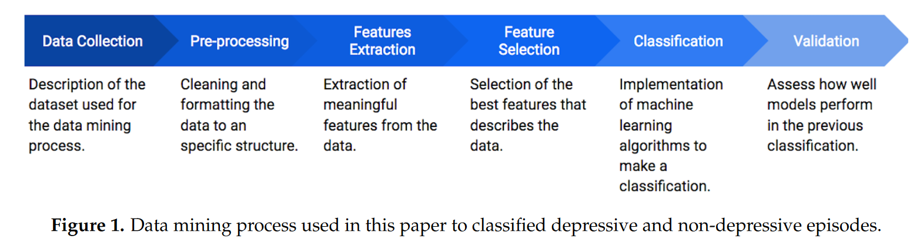
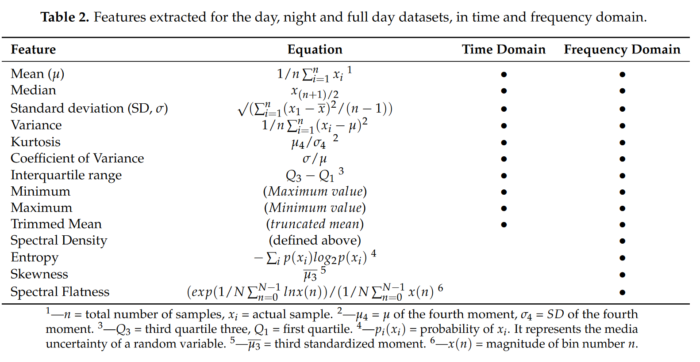
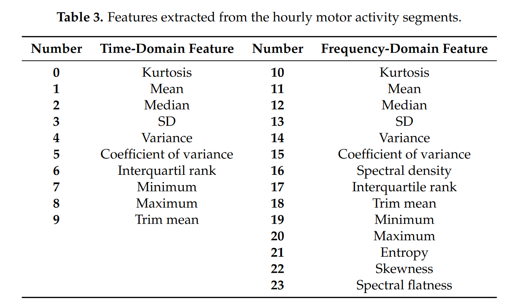
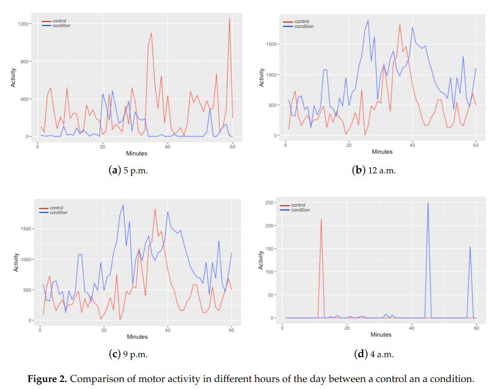

# Notes

## Article details

**Title:** Comparison of Night, Day and 24 h Motor Activity Data for the Classification of Depressive Episodes

**Authors:** Rodríguez-Ruiz, J.G., Galván-Tejada, C.E., Zanella-Calzada, L.A., Celaya-Padilla, J.M., Galván-Tejada, J.I., Gamboa-Rosales, H., Luna-García, H., Magallanes-Quintanar, R. and Soto-Murillo, M.A.

**Citation:** (Rodríguez-Ruiz et al., 2020)

**Bibliography:** Rodríguez-Ruiz, J.G., Galván-Tejada, C.E., Zanella-Calzada, L.A., Celaya-Padilla, J.M., Galván-Tejada, J.I., Gamboa-Rosales, H., Luna-García, H., Magallanes-Quintanar, R. and Soto-Murillo, M.A. (2020) Comparison of Night, Day and 24 h Motor Activity Data for the Classification of Depressive Episodes. Diagnostics [online]. 10 (3), p. 162. Available from: https://www.mdpi.com/2075-4418/10/3/162 [Accessed 18 February 2024].

## Notes

### Abstract

"In this paper, a comparison of motor activity data from the night, day and full day is carried out through a data mining process using the Random Forest classifier to identified depressive and non-depressive episodes. Data from Depressjon dataset is split into three different subsets and 24 features in time and frequency domain are extracted to select the best model to be used in the classification of depression episodes. The results showed that the best dataset and model to realize the classification of depressive episodes is the night motor activity data with 99.37% of sensitivity and 99.91% of specificity."

### Data 

* Depresjon
* 1H, normalised
* Forward selection
* Random Forest

#### processing & features

* day (08:00-20:00)
* night (21:00-07:00)
* full day (24 hours)

**extracted features**

