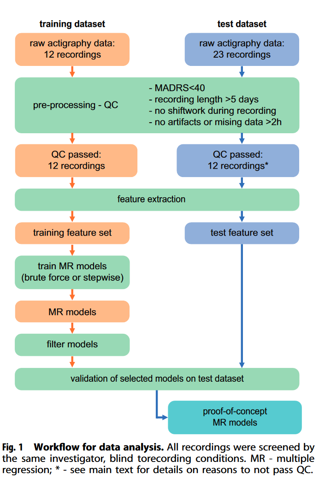
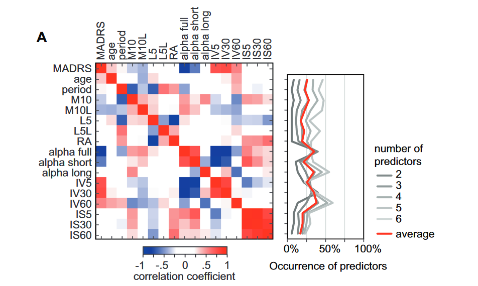
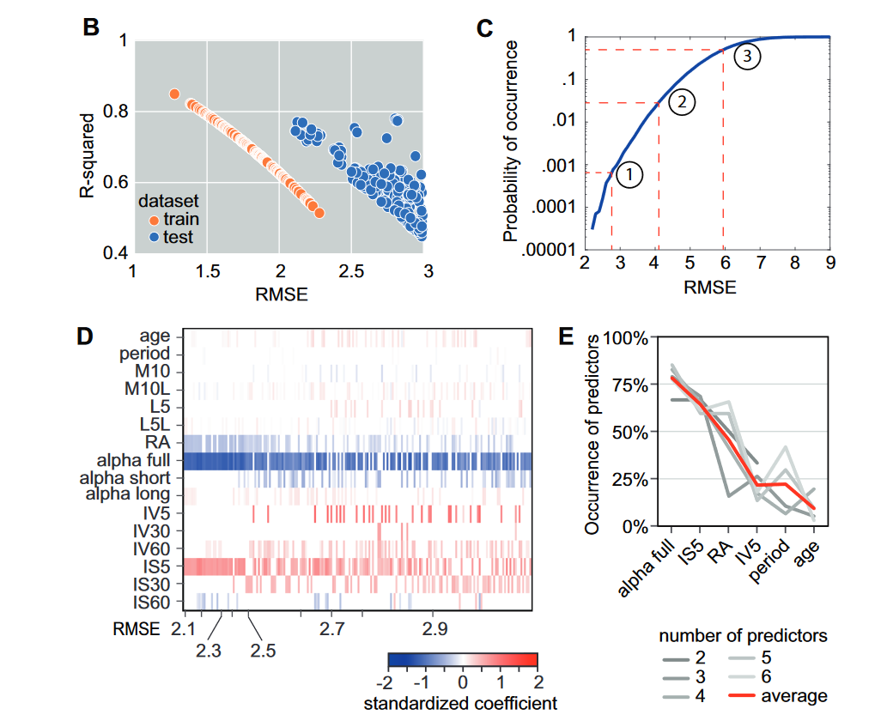
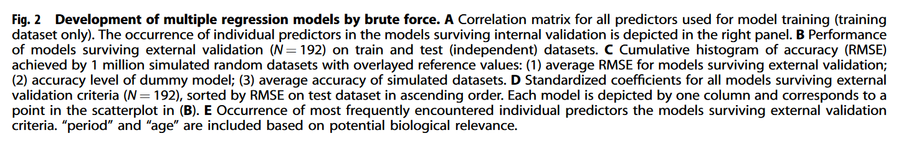
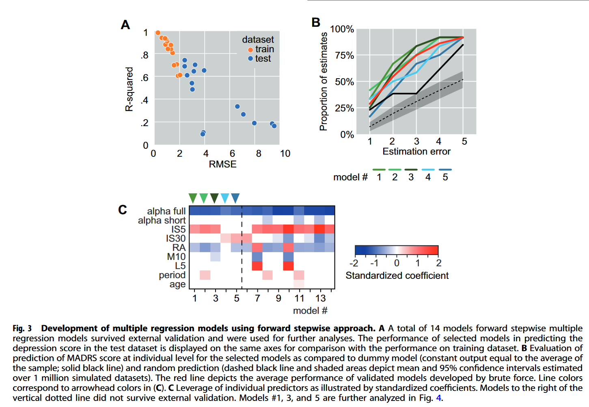
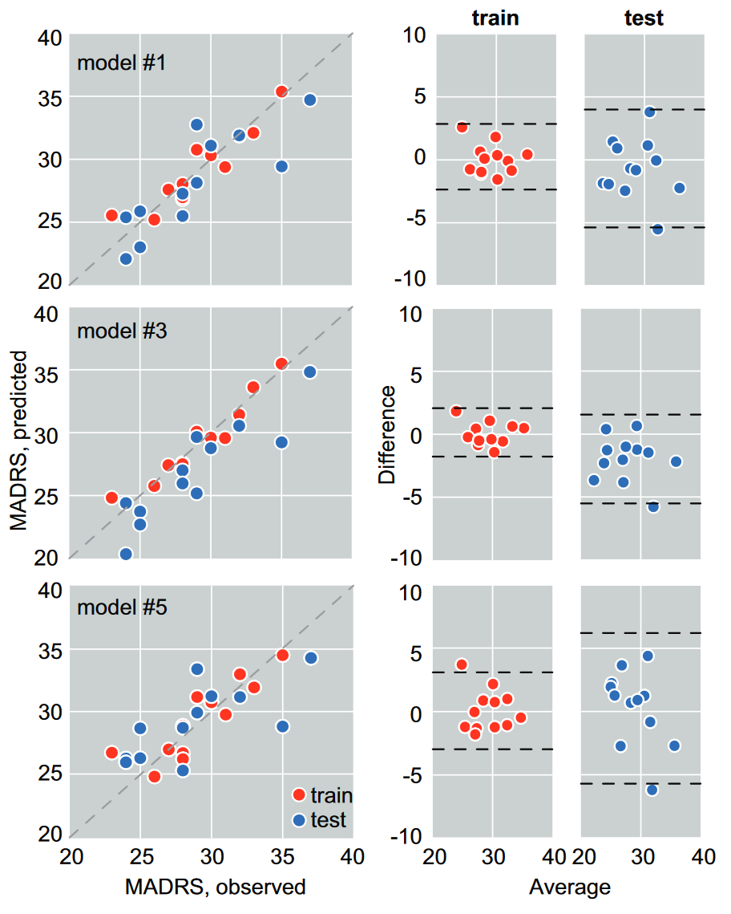
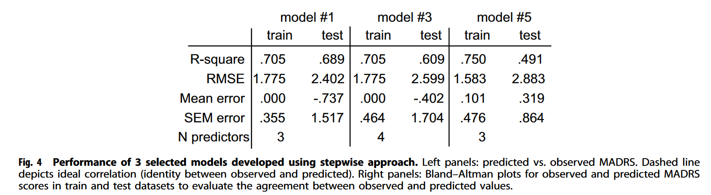

# Notes

## Article details

**Title:** Patterns of activity correlate with symptom severity in major depressive disorder patients.

**Authors:** Spulber, S., Elberling, F., Svensson, J., Tiger, M., Ceccatelli, S. and Lundberg, J.

**Citation:** (Spulber et al., 2022)

**Bibliography:** Spulber, S., Elberling, F., Svensson, J., Tiger, M., Ceccatelli, S. and Lundberg, J. (2022) Patterns of activity correlate with symptom severity in major depressive disorder patients. Translational Psychiatry [online]. 12 (1), pp. 1–8. Available from: https://www.nature.com/articles/s41398-022-01989-9 [Accessed 28 November 2023].

## Notes

### Abstract

"We used actigraphy recordings collected during ongoing major depressive episodes from patients **not undergoing any antidepressant treatment**. The recordings were acquired from two independent studies using different actigraphy systems. Data was quality-controlled and pre-processed for feature extraction following uniform procedures. We trained multiple regression models to predict MADRS score from features of activity patterns using brute-force and semi-supervised machine learning algorithms. The models were filtered based on the precision and the accuracy of fitting on training dataset before undergoing external validation on an independent dataset.  The features enriched in the models surviving external validation point to high depressive symptom severity being associated with less complex activity patterns and stronger coupling to external circadian entrainers. Our results bring proof-of-concept evidence that activity patterns correlate with severity of depressive symptoms and suggest that actigraphy recordings may be a useful tool for individual evaluation of patients with major depressive disorder."

"It has been shown that gene level alterations intrinsic to the molecular clock mechanism (e.g., strength of coupling in circadian oscillations in clock gene expression) are associated with depression [19–21]. In addition, weaker coupling between the central clock and peripheral oscillators has been demonstrated in depressed patients and suicide victims [22], and has been verified in experimental models of depression [23, 24]. **However, correlations between activity patterns and symptom severity in depression have hitherto received very little attention.**"

"To this end we have analyzed actigraphy data using a battery of non-parametric and non-linear approaches for feature extraction. We then trained and validated linear models to predict symptom severity using the extracted features. Our data provide proof-of-concept support for correlation between symptom severity and activity patterns for patients with ongoing major depression episode."

### Materials and Methods

* subjects not undergoing psychopharmacological treatment
* MADRS score between 18 and 35
* 12 subjets for at least 7 consecutive days
* Raw data processed (norm of change, gaussian smoothing, high-pass filter)
  * Sum of changes into 1 minute intervals
  * Aggregated into 1440 samples per 24 hours
  * 6-12 days per subject

**feature extraction**

* "and focused on features describing the regularity, fragmentation, and complexity of circadian patterns of activity."
* "The following features were extracted: circadian period; scaling exponent [4]; intradaily variability; interdaily stability; circadian peak and trough; relative amplitude"

**Circadian period** - `Lomb-Scargle algorithm` optimised for Matlab
* The scaling exponent for detrended fluctuation analysis was calculated for the magnitude of measured activity in 1-min bins using boxes equally spaced on a logarithmic scale between 4 min (4 consecutive samples) and 24 h (1440 consecutive samples) as described by Hu et al."

**Scaling component** - "The scaling exponent is a feature of the intrinsic regulatory mechanisms controlling the rest/activity patterns. It has not been shown to be sensitive to extrinsic factors the subject is exposed to in normal daily activity, but is altered as a result of disease"

**Intradaily variability estimate** - "Intradaily variability estimate the fragmentation of activity patterns by calculating the ratio between mean squared differences between consecutive intervals and the mean squared difference from global mean activity per interval; it increases as the frequency and the magnitude of transitions between rest and active intervals increase, and decreases as the active and inactive intervals consolidate"

**Interdaily stability** - "Interdaily stability evaluates the coupling between activity patterns and circadian entrainers as the ratio between variability around circadian profile and global variability. High values indicate consistent activity patterns across days, consistent with strong coupling between activity and circadian entrainers."

**Relative amplitude** - "The relative amplitude of circadian rhythms of activity (RA) estimates the robustness of average circadian rhythms [1, 2]. The range of RA is bounded between 0 (no circadian rhythms) and 1 (robust circadian rhythms, with consistent timing of consolidated rest interval >5 h across days)."

### Model development

"To limit the risk of overfitting, the maximum number of predictors was limited to 6, which corresponds to a ratio of minimum 2 subjects/predictor"

1. Brute force to explore all models in feature space
2. Refined procedure using ML algorithms to train models of increasing complexity (forward stepwise multiple regression).  
   * entire feature space
   * manually restricted inclusion of features like age and circadian period
   * Iterated using F statistic or Akaike info criterion AIC
3. Models filtered: 
   * variable inflation factor (VIF)<5 for any single predictor
   * coeff of determination $R^2$
   * root mean square error (RMSE) < 3
4. External validaton of filtered models -> test dataset p<0.05 to Pearson R >0.576 and RMSE<3
5. generated dummy model, random prediction dataset

### Results

"Three features displayed significant correlation with the outcome variable (MADRS): scaling exponent for full range (4 min–24 h; alpha full, negative correlation), and intradaily variability for 5 min and 30 min bins (IV5, IV30, positive correlation) (Fig. 2A)."

"On average,the models surviving external validation criteria predict MADRS score within 2 units in 54% of the cases, within 3 units in 75% of the cases, and within 4 units in 87% of the cases.

### Discussion

"Levels of activity and depression symptom severity are linked in a bidirectional manner: on average, higher severity correlates with lower levels of activity, particularly in the moderate activity band [14]; and increasing the levels of activity by physical exercise may in many cases reduce depressive symptoms"

"In addition, we bring proof-of-concept evidence that symptom severity can be predicted by analyzing the subject’s activity recorded over several consecutive days."

* less complex patterns of activity in patients suffering from depression
* higher likelihood to get diagnosed with depression in subjects displaying blunted difference between day-time and nighttime activity levels
* indicate that higher symptom severity is associated with higher IS, suggesting that stronger coupling with circadian entrainers is associated with more severe symptoms
* stronger coupling with circadian entrainers can account for less complex patterns (estimated by scaling exponents), by reducing the contribution of high-frequency fluctuations
* stronger coupling with circadian entrainers does not warrant higher amplitude of circadian rhythms (estimated by RA), if the circadian fluctuations are of small amplitude (i.e., shorter, and less robust bouts of activity, as described previously)

* the features we have extracted are sequence dependent, and do not include summary statistics (e.g., total time inactive, or similar). In addition, our analyses consider the 24-h cycle as a continuum and do not ascertain crisp distinctions between active and resting intervals, nor do we implement any classification of samples or segments based on intensity of activity recorded.