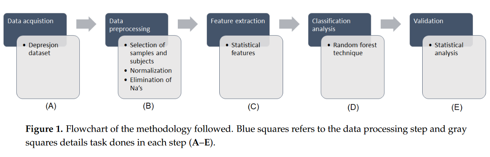
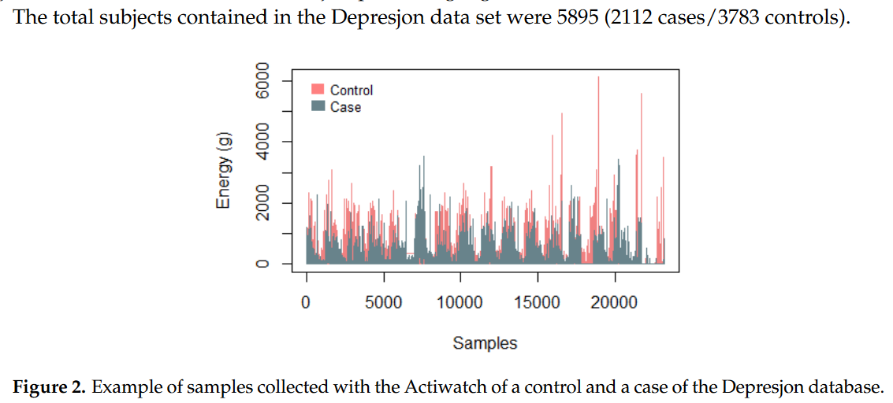
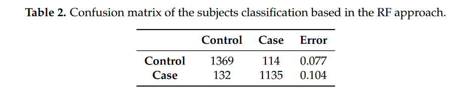
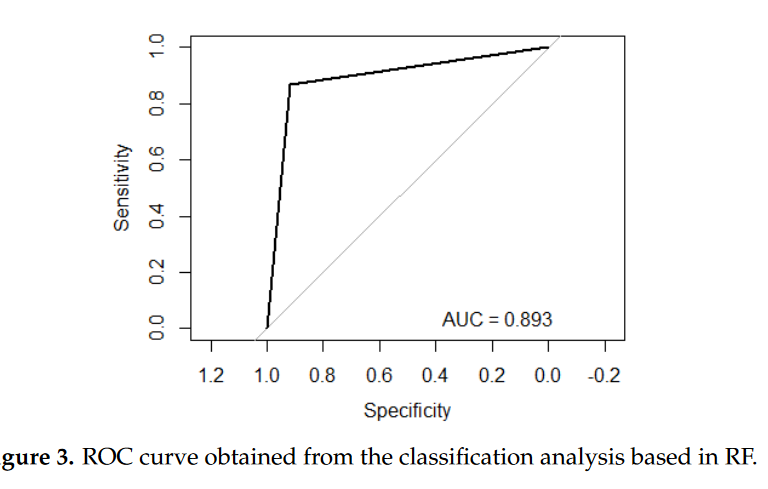
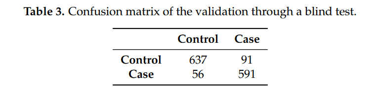
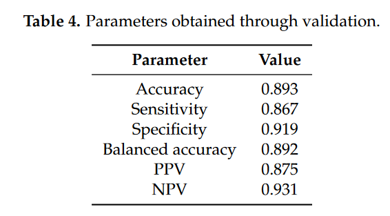
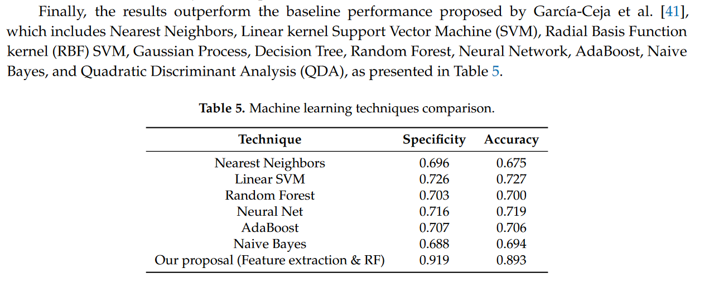

# Notes

## Article details

**Title:** Feature Extraction in Motor Activity Signal: Towards a Depression Episodes Detection in Unipolar and Bipolar Patients

**Authors:** Zanella-Calzada, L.A., Galván-Tejada, C.E., Chávez-Lamas, N.M., Gracia-Cortés, M. del C., Magallanes-Quintanar, R., Celaya-Padilla, J.M., Galván-Tejada, J.I. and Gamboa-Rosales, H.

**Citation:** (Zanella-Calzada et al., 2019)

**Bibliography:** Zanella-Calzada, L.A., Galván-Tejada, C.E., Chávez-Lamas, N.M., Gracia-Cortés, M. del C., Magallanes-Quintanar, R., Celaya-Padilla, J.M., Galván-Tejada, J.I. and Gamboa-Rosales, H. (2019) Feature Extraction in Motor Activity Signal: Towards a Depression Episodes Detection in Unipolar and Bipolar Patients. Diagnostics [online]. 9 (1), p. 8. Available from: https://www.mdpi.com/2075-4418/9/1/8 [Accessed 28 November 2023].

## Notes

### Abstract

"To monitor depression (unipolar and bipolar patients), traditional methods rely on reports from patients; nevertheless, bias is commonly present in them. To overcome this problem, Ecological Momentary Assessment (EMA) reports have been widely used, which include data of the behaviour, feelings and other types of activities recorded almost in real time through the use of portable devices and smartphones containing motion sensors."

"In this work a methodology was proposed to detect depressive subjects from control subjects based in the data of their motor activity, recorded by a wearable device, obtained from the “Depresjon” database. From the motor activity signals, the extraction of statistical features was carried out to subsequently feed a random forest classifier."

Sensitivity: 0.867 (86.7% correct classification of those who are depressed)
Specificity: 0.919 (91.9% correct classification of those who are not depressed)

### Introduction

"The World Health Organisation (WHO) defines that “health is a state of complete physical, mental and social well-being and not only of disease or infirmity”. More than 350 million people in the world suffer from depression and this can become a serious health problem, especially when it is of long duration and moderate to severe intensity, and can cause great suffering, disrupting work, school, family, economic and emotional activities, etc. In the worst case, it can lead to suicide, which is the cause of approximately 1 million deaths annually."

"that require interventions of health services, but this number is underestimated due to the tendency of adolescents to hide and disguise their own problems to adults and their lack of confidence to access therapeutic structures [2]. Depression is a mental disorder characterised fundamentally by depressive mood, loss of interest and enjoyment of the positive aspects of life and fatigue, which impoverish the quality of life and generate difficulties in the family, work and social environment of those who suffer it"

"Traditional methods to monitor depression from unipolar and bipolar patient rely on reports from patients. However, in this type of monitoring, bias is commonly present."

"With the increasing of wearable devices (e.g., monitoring bands, smartwatches, etc.) and smartphones that include motion sensors, such as gyroscopes and accelerometers, EMA measurements can be done almost in real time, helping to monitor mental illness as well as given treatments and interventions, and increase the coverage of mental health services in the population without the need of new specific proposal devices."

"In addition to physical sensors, other approaches include data from social media, which include social networks (for instance, Twitter), online forums and public surveys. These approaches try to identify depressed states through the monitoring of these passive information of the activity of the subject. However, all these approaches need direct interaction of the patient, which can lead to errors in the final diagnosis. Thus, a method that minimises the need of subject interaction to avoid “outliers”, who intentionally overfeed data, is required."

### Materials and methods

**Data preprocessing**
1. selection of samples and subjects
2. elimination of incomplete cases
3. normalisation of data

"preprocessing steps were used to collect a balanced volume of data to carry out the proposed methodology, as well as to make the data present a standard distribution, that is, with an average of zero and a standard deviation of one."

*kept first value of each hour*

"In the selection of the samples, only the first value of the 60 values acquired during 1 h was kept, equivalent to the minutes correspondent to that time lapse, counting now the activity in intervals of 1 h. This procedure was performed for each hour of the total data."

*kept only 4 controls and 5 cases*

"On the other hand, the selection of subjects depended on the volume of data resulting from the selection of samples, looking for the most balanced volume of data possible,. The first four controls present in the dataset and the first five cases were selected, thus balancing the number of samples."

*incomplete cases*

"The elimination of incomplete cases consisted in removing all rows where any missing value was found, represented as NA (not available)."

*normalisation*

"Then, the normalisation was calculated with Equation (1), where zi represents the current value normalised, xi represents the original value, μ represents the mean of the column where the value is located and σ represents the standard deviation. This step was performed to avoid overfitting problems."

$z_i = \frac{x_i − μ }{σ}$

**Feature extraction**

* 14 statistical parameters: 
  * mean
  * standard deviation
  * variance
  * trimmed mean
  * coefficient of variation
  * inversse coefficient of variation
  * kurtosis
  * skewness
  * quantailes (1, 5, 25, 75, 95, 99)

"These statistical features were chosen because they are the first, second, third and fourth moments of an aleatory variable, which represent the descriptive measures that may be used for the characterisation of the probability distribution of that variable. In other words, they describe the characteristics of the time courses of the activity measured"

**Classification Analysis**

* Random Forest (RF) used
* RF is non-parametric used widely in health approaches
* RF v other ML techniques, RF beneficial (vs):
  * ANN (artifical neural network) - see Muhammad et al
    * RF effectively handles missing values during training and testing
    * faster than ANN (artifical neural network)
  * Linear regression
    * LR had lower accuracy predicting certain values
  * Logistic model tree
    * RF most predictive
  * Logistic regression v RF (Ahmadi):
    * RF outperforms on AUC, total accuracy, Kappa coef

* RF decision trees constructed over $n_{tree}$ bootstrap samples - baesd in a replacement principle (bagging approach)
* In every tree node, $m_{feature}$ number of features is randomly selected to determine the splitting rule
* Trees grown up to $n_{tree}$ results in trees with high variance and low bias.
* "Final classification decision taken by calculating arithmetic mean of the class assignment probabilities obtained by all produced trees"
* "From the total amount of samples, about two thirds, called the in-bag samples, are the L selected to train the trees and the remaining one third, called the out-of-bag (OOB) samples, are used for an internal cross-validation to measure the performance of the RF model."

* number of trees = 2000
* number of features at each split = 3

**Validation**

* ROC curve-based approach
* FN, TN, TP, FP

### Results and discussion

* OOB estimate of error = 8.95%

"It is worth mentioning that some of the main reasons for choosing this technique for the classification analysis were that it can be used for handling high-dimensional data, it performs an internal cross-validation, it only has a few tuning parameters, it is easy to interpret even when the relationships between predictors are complex, it uses all available input variables simultaneously, and it has an intuitive structure. Besides, as it is a non-parametric method, it is not necessary to comply with any specific distribution, thus it requires less preprocessing of data compared to other statistical learning methods and it is not greatly influenced by outliers"

"These values represent statistically significant results, since a low percentage of subjects was misclassified in the learning process of RF, which implies that the information contained in the extracted features is presenting values that allow distinguishing between the two possible classes of the subjects. This discussion is supported with the OOB error, validating through a test the performance of the learnt model."

### Conclusions

"Among the **symptoms presented by patients with depression are the slowness of movement, poor body gesticulation and the feeling of fatigue, thus they tend to show lower levels of activity** than subjects who do not have this condition, giving meaning to the results obtained."

"Therefore, the **main benefit presented in this study is a preliminary tool** (bearing in mind that it is necessary to study in greater depth this approach, taking into account the regulations of the health system and characterising the results) that may support the diagnose of specialists to know if a patient presents depression based on the level of activity he has in a full day through the automatic diagnosis of subjects obtained by submitting this information to the model developed in this work, relating the total motor activity with the presence or absence of depression, which is shown, according to the results presented, to have a significantly high accuracy, allowing to reduce false positives and false negatives in the detection of this condition, thus improving the diagnosis of this disease.."

"Finally, it is important to mention that the **main limitation of this study is the large volume of data on the motor activity required** by each patient, which makes the analysis of the data a bit complex and delayed, causing a small number of subjects to be used. On the other hand, a **limiting factor that could broaden the focus of this work would be to know information about patients in relation to any psychiatric or other treatment** (e.g., sleeping pills) that they are currently undergoing, allowing us to know if this influences the amount of activity performed by the subjects, which could affect the controls by reducing their physical activity, causing false positives."

### Future Work

"As future work, it is proposed to increase the number of subjects in the experimentation to present results based on a greater diversity of data and thus highlight the robustness of the results. In addition, the inclusion of a stage of feature selection is proposed, comparing different machine learning tools, to know which are the features that have the greatest contribution in the classification of depressive and non-depressed subjects."