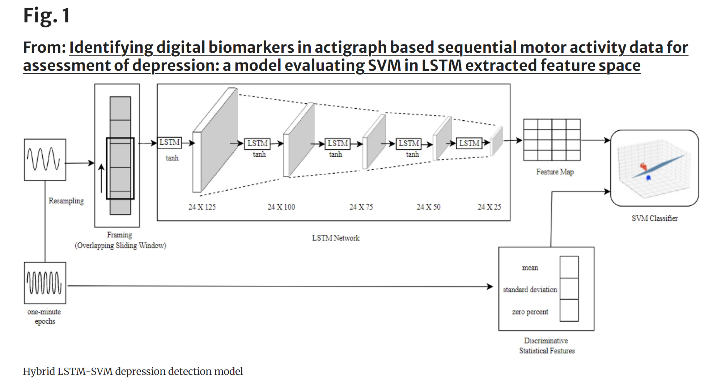
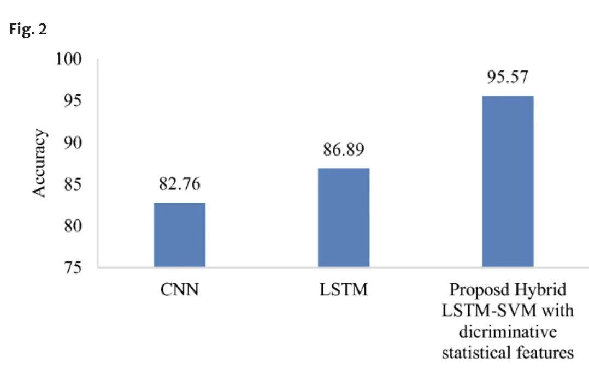
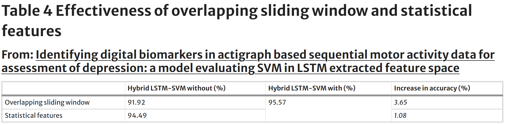

# Notes

## Article details

**Title:** Identifying digital biomarkers in actigraph based sequential motor activity data for assessment of depression: a model evaluating SVM in LSTM extracted feature space

**Authors:** Arora, A., Chakraborty, P. and Bhatia, M.P.S.

**Citation:** (Arora, Chakraborty and Bhatia, 2023)

**Bibliography:** Arora, A., Chakraborty, P. and Bhatia, M.P.S. (2023) Identifying digital biomarkers in actigraph based sequential motor activity data for assessment of depression: a model evaluating SVM in LSTM extracted feature space. International Journal of Information Technology [online]. 15 (2), pp. 797–802. Available from: https://doi.org/10.1007/s41870-023-01162-5 [Accessed 17 February 2024].

## Notes

### Abstract

"This research puts forward a methodology for depression assessment using actigraph recordings of motor activity. High level features of motor activity are extracted using Long-Short Term Memory (LSTM) which are paired with statistical features to deliver valuable digital biomarkers. Overlapping sliding window is used to input sequences into LSTM to capture superior features in activity recordings. The predictive ability of these digital biomarkers is evaluated using Support Vector Machine (SVM). The hybrid framework is validated on benchmark, Depresjon dataset and achieves accuracy of 95.57%. Effectiveness of overlapping sliding window and statistical features is evaluated, and their significance is validated. It is validated that the concept of overlapping sliding window improves performance accuracy by 3.51% and the use of discriminative statistical features improves model performance by 1.08%. It is concluded that the proposed methodology based on feature extraction, statistical features and overlapping sliding window outperforms state-of-the-art techniques as well as baseline deep learning algorithms for depression detection."

"Early detection of behavioral symptomatology of mental illness can be done by observing patterns in people’s daily activities."

"Wearable activity trackers collect fine-grained sensor data characterizing the behavior and physiology of users providing objective measures of physical activity. Digital biomarkers derived from these sensor recordings can aid in the improved monitoring and detection of episodes associated with mental health disorders. These digital biomarkers could be used for timely, unobtrusive, and scalable screening of mental health. The Actigraph sensor, for example, is a widely used wearable sensor for assessing a person’s physical activity and sleep [9]. It is a non-invasive way to track people’s rest/activity cycles. Individuals can eventually be screened for depression using this actigraphic pattern analysis."

**deep learning - extract HL features + hand-crafted statistical features**

"Deep Learning models can extract high-level features from serial data without explicit feature engineering, making them an efficient tool for diverse signal analysis [10, 11]. Simultaneously statistical features of sequential data may carry additional informative cryptograms for better classification of disorders. Combining both these feature categories can define valuable digital biomarkers for assessment of mental health indicators. Hence, this study proposes a novel methodology that combines the capabilities of deep learning extracted high-level features and handcrafted statistical features of actigraph based motor activity measurements to form digital biomarkers for detection of depression."

**approach**

"This study uses the **complex features extracted using Long Short Term Memory (LSTM) using overlapping sliding sequences of activity measurements combined with the statistical features of the data for depression detection**. Original activity data are resampled, and 24-h recording sequences are input into the LSTM for high-level feature extraction. These extracted features are then merged with statistical attributes from the activity recordings, and a Support Vector Machine (SVM) is trained for classification. The hybrid LSTM-SVM model is validated on benchmark dataset namely the Depresjon dataset."

* depresjon dataset
* N days 
* downsampled 1H
* overlapping sliding sequence window of 24 records (24 hours of data)
* windows overlap by 12 readings (50%)
* each 24 hour window becomes one training example for the model

**LSTM**

* 5 LSTM layers - nodes 125, 100, 75, 50, 25 and drop out value of 0.1
* hyperbolic tangent (tan h) activation function used
* feature map extracted from last layer = 25 features (from layer 5) for each 24 hour sequence

**statistical features**

* mean, std
* proportion of events with zero activity over a series for prediction
* feature vector for sequence of 1440 data points
* hop size is 720

**SVM**

* linear kernel c value = 0.1

## Results

* 10 fold cross validation
* 95.57% accuracy, F1 score of 0.955

### comparison to other deep learning: 

### Effectiveness of overlapping sliding window and discriinative statistical features

### comparison with existing models

## conclusion

* combine LSTM and SVM
* LSTM to get high-level features from 24 hour overlapping recorrds
* SVM model trained using combined feature map

**future work - where can we take this?**

* more complex deep learning architecture - bidirectional LSTM, attention model
* apply to severity levels

